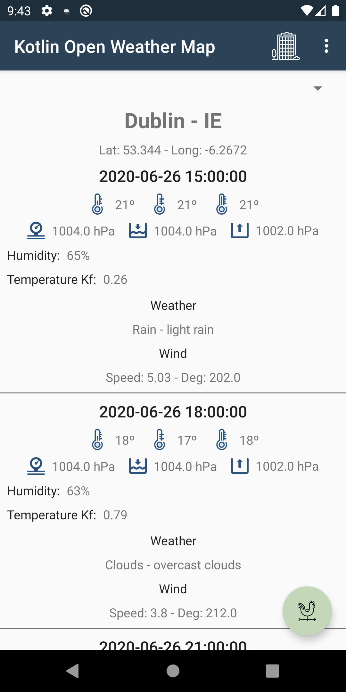
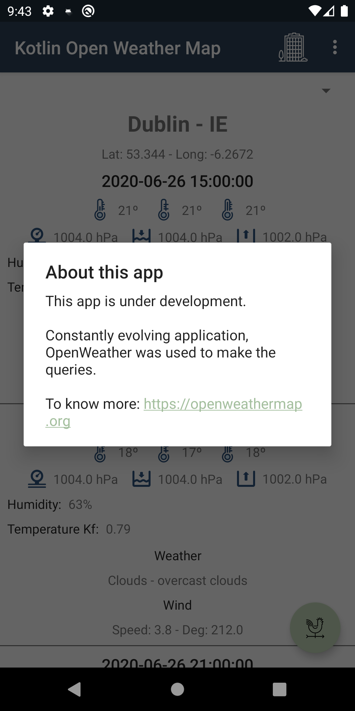

# Kotlin Open Weather Map
This app is displaying Dublin 5-day weather forecast.
https://openweathermap.org/forecast5 - This site was used to search the weather information.

## Installation
1. Download this code from Android Studio, 
2. Click the Run button or Debug,
3. Run it on an emulator or install it on a mobile phone.

### Screenshots
Home Screen | About
--- | ---
 | 

## Usage
TODO: Still under development.

## TO-DO
1. I need to improve the visualization of the application.
2. I need to improve how to request site data.
3. I need to implement the tests.

## History
- Start this application.
- Update visualization.

## Licence
Copyright 2019 Daniel Freitas Vilha
```
Permission is hereby granted, free of charge, to any person obtaining a copy
of this software and associated documentation files (the "Software"), to deal
in the Software without restriction, including without limitation the rights
to use, copy, modify, merge, publish, distribute, sublicense, and/or sell copies
of the Software, and to permit persons to whom the Software is furnished to do so,
subject to the following conditions:

The above copyright notice and this permission notice shall be included in all
copies or substantial portions of the Software.

THE SOFTWARE IS PROVIDED "AS IS", WITHOUT WARRANTY OF ANY KIND, EXPRESS OR
IMPLIED, INCLUDING BUT NOT LIMITED TO THE WARRANTIES OF MERCHANTABILITY,
FITNESS FOR A PARTICULAR PURPOSE AND NONINFRINGEMENT. IN NO EVENT SHALL
THE AUTHORS OR COPYRIGHT HOLDERS BE LIABLE FOR ANY CLAIM, DAMAGES OR OTHER
LIABILITY, WHETHER IN AN ACTION OF CONTRACT, TORT OR OTHERWISE, ARISING FROM,
OUT OF OR IN CONNECTION WITH THE SOFTWARE OR THE USE OR OTHER DEALINGS IN THE
SOFTWARE.
```